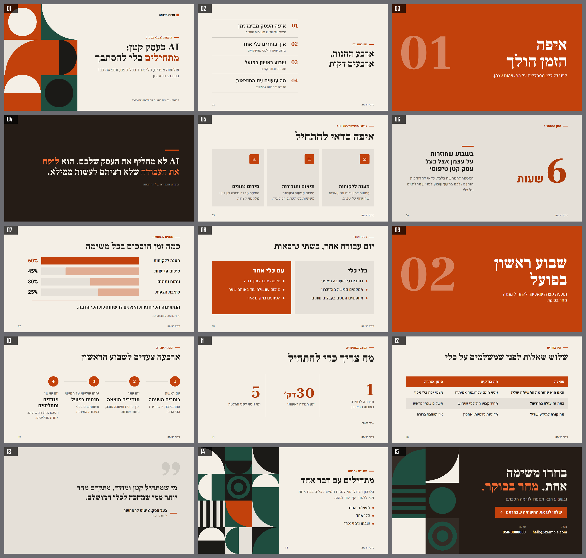

# מצגות מקצועיות בעברית: JSON אחד, HTML אינטראקטיבי ו־PowerPoint

סקיל לסוכני AI (Claude Code, Codex) שיוצר מצגות ברמה גבוהה. כותבים את התוכן, והמערכת מטפלת בכל השאר: טיפוגרפיה עברית, צבעים בדוקי ניגודיות, 17 פריסות, גרפים וטבלאות אמיתיים, אמנות גנרטיבית, תנועה, הערות מרצה, ובדיקת איכות אוטומטית שעוצרת פגמים לפני המסירה.



## התקנה

דרישות: Node.js 22.13 ומעלה ו־Chrome, Edge או Chromium. PowerPoint נדרש רק לרינדור הוכחה בתוכנה עצמה.

```bash
git clone https://github.com/Meir770ar/html-to-pptx-skill.git html-to-pptx
cd html-to-pptx
npm ci
```

לשימוש כסקיל, העתיקו את התיקייה אל `~/.claude/skills/html-to-pptx` או `~/.codex/skills/html-to-pptx`. פרטים ב־[SETUP.md](SETUP.md).

## שימוש

```bash
node scripts/make-deck.cjs examples/demo.json out/ --overwrite
```

הפקודה עושה הכול בריצה אחת:

1. **בונה** מצגת HTML אינטראקטיבית מה־spec: ניווט מקלדת, חשיפות, מצב מרצה, מסך מלא.
2. **בודקת עיצוב** בדפדפן אמיתי: גלישה, חפיפות, גודל טקסט, ניגודיות, צפיפות, קצב המצגת, תמונות בלי alt.
3. **מייצאת PowerPoint:** `deck.pptx` (טקסט, צורות, טבלאות וגרפים ניתנים לעריכה) ו־`deck-faithful.pptx` (תמונות, נאמן לגמרי).
4. **מפיקה הוכחות:** תמונה לכל שקופית וגיליון תצוגה אחד לכל המצגת. ב־Windows עם PowerPoint, `--powerpoint` מרנדר את הקבצים בתוכנה עצמה.

מה כתוב ב־spec ומה אפשר לעשות: [references/spec-reference.md](references/spec-reference.md). מה הופך מצגת לטובה: [references/design-principles.md](references/design-principles.md). דוגמה מלאה: [examples/demo.json](examples/demo.json).

```json
{
  "title": "שם המצגת",
  "theme": "editorial",
  "brand": "שם המרצה",
  "slides": [
    { "layout": "cover", "title": "כותרת עם *הדגשה*", "subtitle": "משפט תמיכה", "notes": "מה אומרים" },
    { "layout": "points", "title": "שלושה עקרונות", "items": [
      { "icon": "target", "title": "מטרה אחת", "text": "משפט קצר." },
      { "icon": "clock", "title": "קצב קבוע", "text": "משפט קצר." },
      { "icon": "shield", "title": "שקיפות", "text": "משפט קצר." } ] },
    { "layout": "closing", "title": "מסר אחד ופעולה אחת", "action": "הצעד הבא" }
  ]
}
```

## ערכות נושא ופריסות

שש ערכות (`editorial`, `midnight`, `bold`, `corporate`, `sage`, `noir`) ו־17 פריסות: פתיחה, תוכן, מפריד פרק, משפט, כרטיסים, מספר ענק, מדדים, השוואה, תהליך, גרף פסים ועמודות, ציטוט, תמונה, פיצול, גלריה, טבלה, סיום, ומוצא חירום ב־HTML חופשי. צבעי מותג מוגדרים ב־`palette` והמערכת מתקנת ניגודיות לבד.

הפונטים (Heebo, Rubik, Frank Ruhl Libre, Secular One) ברישיון SIL OFL וכלולים. להתקנתם עבור `deck.pptx`: `node scripts/install-fonts.cjs`.

## שדרוג מצגת קיימת והמרת HTML

```bash
node scripts/redesign-pptx.cjs restyle source.pptx redesigned.pptx --preset=editorial --layout=auto
node scripts/redesign-pptx.cjs verify source.pptx redesigned.pptx
node scripts/html-to-pptx.js deck.html out.pptx --mode=editable --rtl
```

שדרוג עיצוב נועל את התוכן וההערות ובודק שימור: [references/redesign-existing.md](references/redesign-existing.md), [references/reference-design-language.md](references/reference-design-language.md). חוזה הייצוא של המרת HTML שרירותי: [references/export-contract.md](references/export-contract.md).

| יצוא | מראה | עריכה |
|---|---|---|
| `image` | צילום הדפדפן ברזולוציה גבוהה | תמונה אחת לשקופית |
| `hybrid` | עיצוב הדפדפן עם טקסט Office | טקסט רגיל; הגרפיקה ברקע |
| `editable` | פריסת DOM עם רכיבי Office | טקסט, צורות, טבלאות ותמונות; אפקטים לא נתמכים מצולמים |

אנימציות ואינטראקציות נשארות ב־HTML. ב־PowerPoint נשמרים מצב סופי, חשיפות לפי בקשה (`--fragments=steps`) ומעבר Fade. הערות המרצה נשמרות.

## בדיקות

```bash
npm test
```

הבדיקות מכסות: ניגודיות בכל הערכות, טיפול בטקסט מעורב, תקינות ה־spec, בנייה ובדיקת עיצוב של כל הפריסות בכמה ערכות, זיהוי פגמים אמיתיים, ייצוא PowerPoint (כולל סדר `72%` ושקופיות מרובות עם אייקונים), מצגת אנגלית משמאל לימין, שימור תוכן בשדרוג ושחזור שקופיות.

החבילה אינה כוללת credentials או מידע אישי. הפונטים הכלולים הם קוד פתוח בלבד.
